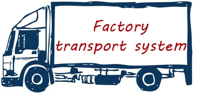

**C++** project to track trasport system of factory. This document lists important design aspects of project.

## OOP classes identification

+ Location class
+ Factory class
+ Branch class
+ Warehouse class
+ Vehicle class
	* Truck class
+ Container class
+ Item class

### Location class

The location class provides location to objects. The location **MUST** be a member of `City enum`. This class provides simple getter and setter methods for location. The location **MUST** be specified for `Factory`, `Branch` and `Vehicle` class.

+ `Location` class provides method to calculate distance between two objects.
+ `Location` class also provides estimated time to travel between places.

		class Location{
		public:
			inline City getLocation(){
				return current_location;
			};
			int getDistance(const Location &dest);
		protected:
			City current_location;
		};

> TODO ::

>Add support for GPS location

>Add support for google maps

### Factory class

The factory class holds information about the company. Basic factory information such as name, registered address will be stored here (and can't be changed once set). All the assets ( including `Branch`es and `Vehicle`s are owned by Factory.)

+ **One** `Factory` **has many** `Branch`es.
+ **One** `Factory` **has many** `Vehicle`es.
+ **One** `Factory` **has one** `Location`.

		class Factory : public Location{
		public:
			Factory(const string name, City location);
			bool addVehicle(Vehicle vehicle);
			inline Vehicle getVehicle (const int vehicle_number){
	  		// Give the vehicle of number 'vehicle_number' to the requester.
	  		return vehicles[vehicle_number];
    		};
			inline string getCompanyName(){
	  		// The business name once set during initialization can't be changed.
	  		// Give the name of this business to requester.
	  		return businessName;
    		};
			string getDetails();
		protected:
			static map<string, Vehicle> vehicles;
		private:
			string businessName;
		};

### Branch class

The `Branch` class holds information about branch and warehouses. `Branch` is **a kind of** `Factory`. Branch can add/remove vehicles **on behalf of** a `Factory`. Although branch can add/remove `Vehicle`, The records of vehicles owned by `Factory` will be kept at `Factory`.

+ A `Branch` can load/unload `Vehicle`s.
+ A `Branch` maintains records of items in `Warehouse`.
+ A `Branch` instructs `Vehicle` to carry goods from `Warehouse` to another `Branch`.
+ **One** `Branch` **has many** `Warehouse`s.

### Warehouse class

This class holds all the `Item`s, that this `Factory` owns. `Warehouse`s are controlled by the respective `Branch`es. `Warehouse` stores basic name/address information with it.

> TODO::
> Add notification system for alerts and information.